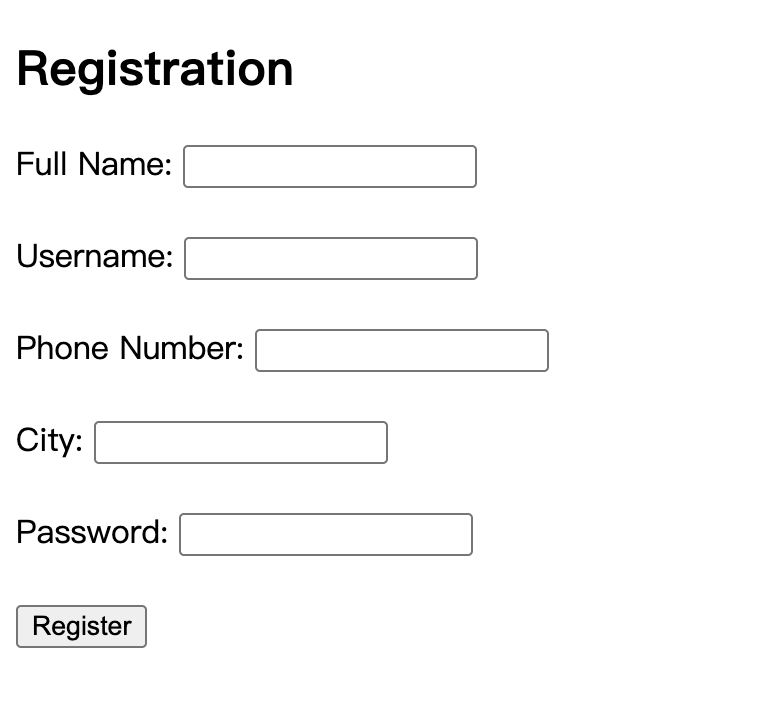
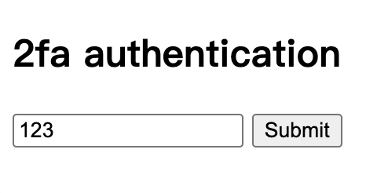

<!--more-->

**使用工具或套件**

- Burp Suite

---

### 打開 Burp Suite

切換到 `Proxy` -> `Intercept`，然後點選 `Open browser`，用它的瀏覽器去開網站

### 打開網站

開啟後，會看到以下這個表單，表單內容隨便填就好


### OTP

下個畫面會導向到 OTP 驗證，內容一樣隨便填，然後把 Burp Suite 的 Intercept 切成 on 之後送出表單


在 Burp Suite 攔截封包，然後刪除第七行的 `otp=123`，再按 Forward 後

```text{linenos=table,hl_lines=[7],linenostart=1}
...
Referer: http://titan.picoctf.net:52900/dashboard
Accept-Encoding:gzip,deflate,br
Cookie: session=
Connection: keep-alive

otp=123
```

回到瀏覽器就會看到


### Flag

> picoCTF{#0TP_Bypvss_SuCc3$S_9090d63c}
